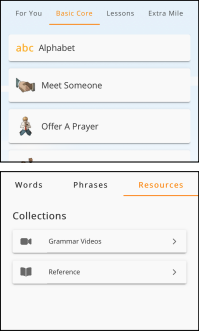

# Projects

<!DOCTYPE html>
<html lang="en">
<head>
    <meta charset="UTF-8">
    <meta name="viewport" content="width=device-width, initial-scale=1.0">
    <title>EnglishConnect I for Missionaries</title>
    <link rel="stylesheet" href="styles.css">
</head>
<body>
  <header style="background-image: url('pocket-watch.jpeg'); background-size: cover; background-position: center;">
      <h1>EnglishConnect for Missionaries</h1>
      <h2>Starter Guide</h2>
    </header>
    
    <section id="section-one">
        <h1>To Prepare for EnglishConnect I</h1>
        <h3>Step One: Get the TALL Embark Mobile App</h3>
        <ul>
          <li>Go to: <a href="#" class="button">httlis://tall.global/embark</a></li>
          <li>Sign in using your Church Account</li>
          <li>For "I Want to Learn", choose English.</li>
          <li>For "Native Language", choose your native language.</li>
          
        </ul>
    </section>
    
    <section id="section-two">
        <h2>Step Two: Familiarize yourself with these sections of Embark</h2>
        <h3>Learn:</h3>
        <ul>
        <li>Basic Core</li>
        <li>Daily Life</li>
        <li>Review</li>
        <li>Manage</li>
        <li>Quiz Me</li>
        </ul>
    
        <h3>Explore:</h3>
        <ul>
        <li>Resources</li>
        <li>Grammar Videos</li>
          <li>To see the Grammar Videos: Choose "Explore"> "Resources"> "Grammar Videos"</li>
        </ul>
        <!--  -->
        

        <h3>Tips for Success:</h3>
        <ul>
        <li>Make your own flashcards or keep a list of new vocabulary and key phrases in a study notebook.</li>
        <li>Take notes while you watch the videos. Speak aloud with the videos. Watch 2 or 3 times.</li>
        <li>Practice the vocabulary and phrases with a partner as often as possible.</li>
        </ul>
    </section>
    
    <section id="section-three">
        <h2>Step Three: Study these lessons</h2>
        <h3>Watch the Grammar Videos, learn the Vocabulary, and practice the Phrases.</h3>
        <h3>Lesson 1 - Basic Core: Alphabet</h3>
        
1. <a href="#" class="button">Learn and practice the Alphabet.</a>

        <h3>Lesson 2 - Basic Core: Meet Someone</h3>

        
1. <a href="#" class="button">Watch Grammar Video 1: Subject pronouns</a>

        
2. <a href="#" class="button">Watch Grammar Video 2: "To Be" (Aff+Neg)</a>

        
3. <a href="#" class="button">Learn the "Vocabulary"</a>

        
4. <a href="#" class="button">Practice the "Phrases.</a>

        <h3>Lesson 3 - Daily Life: Numbers</h3>

        
1. <a href="#" class="button">Watch Grammar Video 3: "To be" Questions (Questions using the verb "To be")</a>

        
2. <a href="#" class="button">Watch Grammar Video 4: "To be" Contractions (Contractions using the verb "To be")</a>

        
3. <a href="#" class="button">Learn the Vocabulary: Numbers 1-20</a>

        <h3>Lesson 4 - Daily Life: Family</h3>

        
1. <a href="#" class="button">Watch Grammar Video 26: "To have" (v. To have)</a>

        
2. <a href="#" class="button">Watch Grammar Video 13: "Pluralization" (Pluralization)</a>

        
3. <a href="#" class="button">Learn the "Vocabulary"</a>

        
4. <a href="#" class="button">Practice the "Phrases"</a>

        
        <h3>Lesson 5 - Basic Core: Helpful Classroom Vocabulary</h3>

        
1. <a href="#" class="button">Watch Grammar Video 15: "Possessive Adjectives"</a>

        
2. <a href="#" class="button">Watch Grammar Video 23: "Wh- questions" (Questions using who, what, where, when, and why)</a>

        
3. <a href="#" class="button">Learn the "Vocabulary"</a>

        
4. <a href="#" class="button">Practice the "Phrases"</a>

        <h3>Lesson 6 - Basic Core: Offer a Prayer</h3>

        
1. <a href="#" class="button">Watch Grammar video 8: "Word Order"</a>

        
2. <a href="#" class="button">Learn the "Vocabulary"</a>

        
3. <a href="#" class="button">Practice the "Phrases"<a>

    </section>
    <footer>
      
&copy; 2023 EnglishConnect. All rights reserved.

  </footer>
</body>
</html>

body {
    margin: 0;
    padding: 0;
    font-family: Arial, sans-serif;
    text-align: left;
    height: auto;
    max-width: 100%;
}

header {
    /* position:absolute; */
    background-color: #333;
    height: 200px;
    background-size: cover;
    background-position: center;
    color: lightblue;
    font-family:Georgia, 'Times New Roman', Times, serif;
    padding: 0;
    margin: 0;
    width: 100%;
}
header h1{
  font-family: Georgia, 'Times New Roman', Times, serif;
  text-align: center;
}
header h2 {
  text-align: center;
}

#section-one {
    background-color: #f2f2f2;
    padding: 50px;
    text-align: left;
}

#section-one h1 {
  text-align: center;
  font-size: xx-large;
}

#section-one h3 {
  font-size: x-large;
}

#section-one li {
  margin-bottom: 20px;
  text-decoration: dotted;
  font-size: medium;
}

#section-two {
    background-color: #e6e6e6;
    padding: 50px;
    text-align: left;
    text-decoration: none;
}

#section-two h2{
  font-size: x-large;
}

#section-two li {
  margin-bottom: 15px;
  text-decoration: dotted;
  font-size: medium;
  text-align: justify;
  text-indent: 5px;
}

#section-three {
    background-color: #d9d9d9;
    padding: 50px;
    text-align: left;
}

#section-three h2 {
  font-size: x-large;
}

#section-three h3 {
  text-align: justify;
}

#section-three p {
  margin-bottom: 20px;
  font-size: medium;
  text-indent: 30px;
  text-align: justify;
}

h2 {
    font-size: 36px;
    margin-bottom: 20px;
    text-decoration: none;
}

p {
    font-size: 20px;
    margin-bottom: 20px;
}
#box {
  position:absolute;
  top: 25%;
  left: 80%;
  bottom: 20%;
  transform: translateX(-50%);
  width: 250px;
  height: 350px;
}
#sisters {
  position:absolute;
  width: 500px;
  left: 55%;
  opacity:0.5;
  height: auto;
  float: right;
  margin: 5px;
  top: 73%
}
#elders {
  position:absolute;
  width: 500px;
  left: 55%;
  opacity:0.5;
  height: auto;
  float: right;
  margin: 5px;
  top: 165%
}

footer {
  padding:10px;
}
